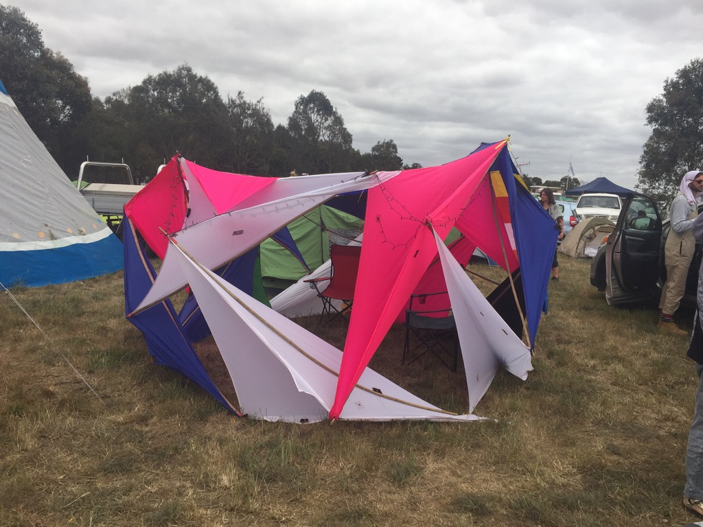

# *Will Nash - selected works*

## Introduction
This github repository contains a selection of rhino3dm, grasshopper and scripting examples that I have produced over the years. Below are some very brief descriptions of these.

### gh/
Grasshopper files, should be opened with Rhino 7.

* funnelFinal.gh: used to form the futuristic structure for the Anima submission to the IAAC *Design for Biocities* competition in 2022.

* wicker.gh: an early iteration of a woven structure intended to capture dew in the desert.

* voronoiRing.gh: used to generate a simple shank ring and split it with a 3d voronoi. The cells are then randomly scaled up or down to provide texture. This definition was used in preparing the *intragranular ring*.

* peñaTensegrity.gh: definition to form the tensegrity structure based on [thesis of Diana Peña](https://upcommons.upc.edu/handle/2117/94685), uses Kangaroo Physics for form finding. Dimensions were used for constructing a tensegrity structure at Meredith Music Festival, (photo below)

  
  
  
  

### rhino3dm/
* spiderbubbles.3dm: the output of the funnel.gh file below with material properties added.

### scripts/
several scripts written in rhinopython to generate geometries.

### deep learning
* [SpotRust](https://github.com/StuvX/SpotRust): the repository for the Bayesian deep learning corrosion detection model, includes custom Bayesian layers and loss functions.
